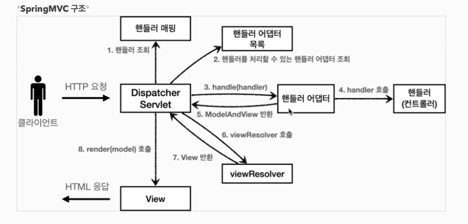
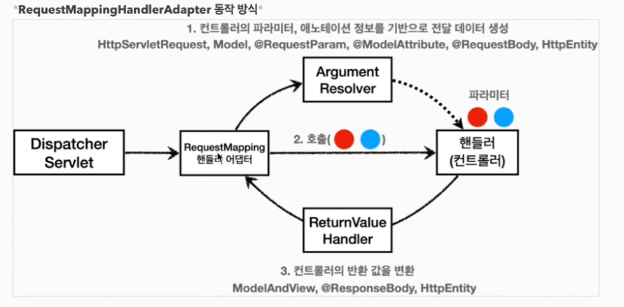
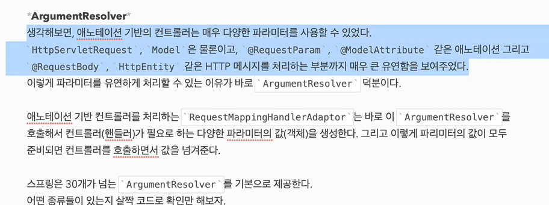

# @RestController
* @Controller 대신 @RestController 애노테이션을 사용하면, 해당 컨트롤러에 모두 @ResponseBody 가 적용되는 효과가 있다.
* 따라서 뷰 템플릿을 사용하는 것이 아니라 Http 메시지 바디에 직접 데이터를 입력한다. 이름 그래도 Rest API(Http API)를 만들때 사용하는 컨트롤러이다.

참고로 @ResponseBody는 클래스 레벨에 두면 전체에 메서드에 적용되는데 @RestController 애노테이션 안에 @ResponseBody가 적용되어 있다.

# 요청 매핑 핸들러 어뎁터 구조
그렇다면 HTTP 메시지 컨버터는 스프링 MVC 어디쯤에서 사용되는 것일까?

모든 비밀은 어노테이션 기반의 컨트롤러, 그러니깐 @RequestMapping 을 처리하는 핸들러 어탭터인 
requestMappingHandlerAdapter (요청 매핑 핸들러 어텝터)에 있다.

**** 

